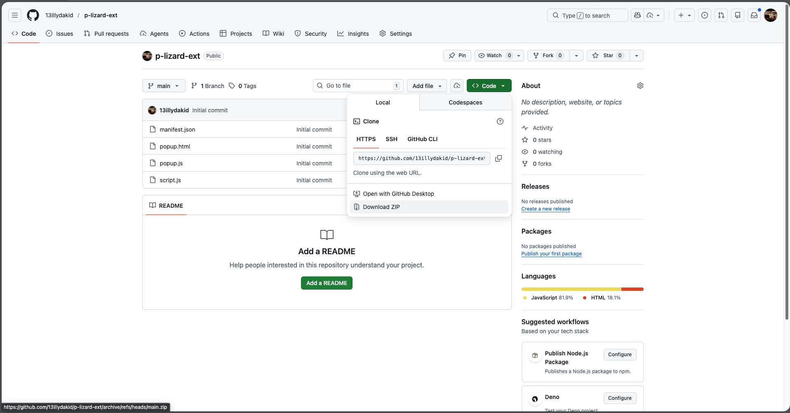
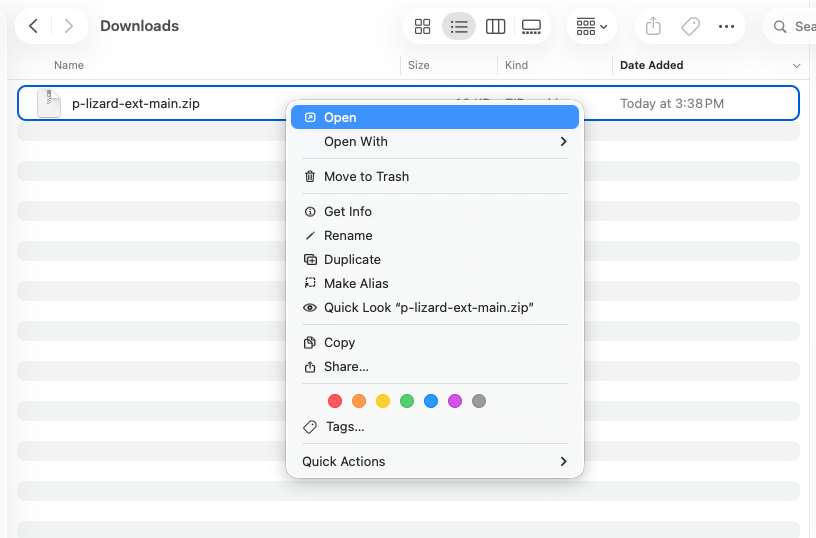
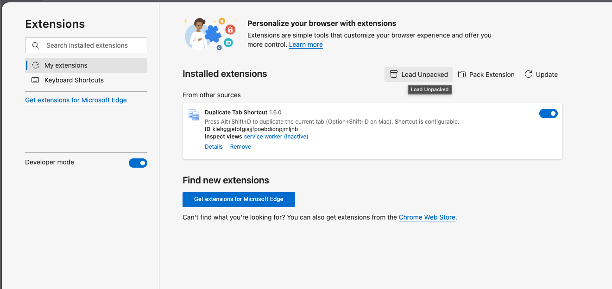
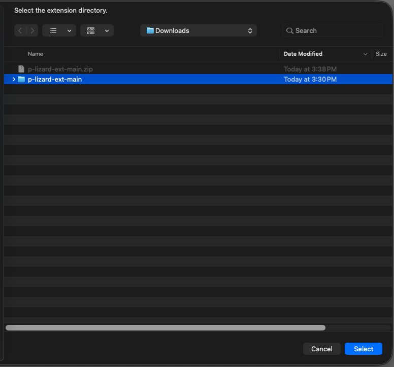
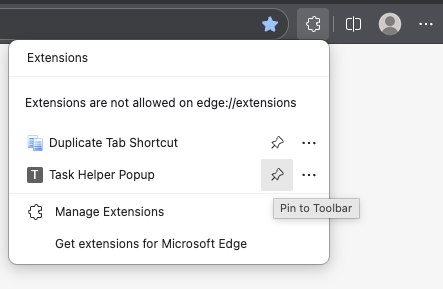
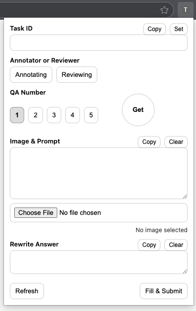

# p-lizard-ext

A small Manifest V3 browser extension that adds a popup form and injects scripts into supported pages.

## Download ZIP

1. Open the repo on GitHub
2. Click **Code** → **Download ZIP**

3. Unzip it (you should end up with a folder containing `manifest.json`)

## Install (Chrome / Brave / Edge)

1. Open `chrome://extensions || edge://extensions`
2. Turn on **Developer mode**
3. Click **Load unpacked**

4. Select the extension folder (the one that contains `manifest.json`)

The extension should now appear in your extensions list.

Pin extension to the toolbar.

## Use

<table>
   <tr>
      <td>

1. Click the extension icon to open the popup
2. Fill in the form fields
3. Use:
    - **Set** to pull the Task ID from the active tab (when supported)
    - **Get** to pull prompt/answer for the currently selected QA (when supported)
    - **Fill & Submit** to inject and run the automation on the active tab

      </td>
      <td>
         
      </td>
   </tr>
</table>

## Permissions / Supported sites

This extension requests access on:
- `https://editor.superannotate.com/*`
- `https://custom-llm.superannotate.com/*`

If you don’t see the buttons working, confirm your active tab is on one of the supported URLs.

## Update

After pulling new changes, go back to `chrome://extensions || edge://extensions` and click **Reload** on the extension card.
